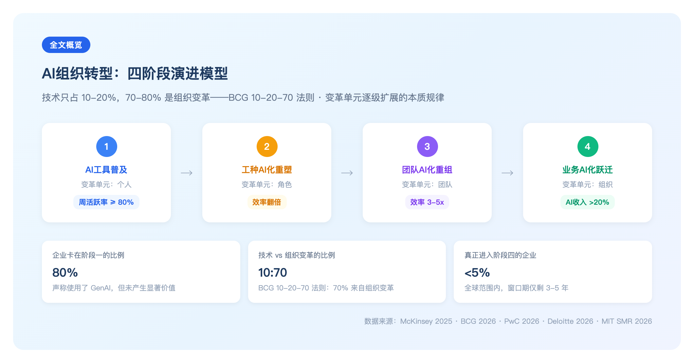
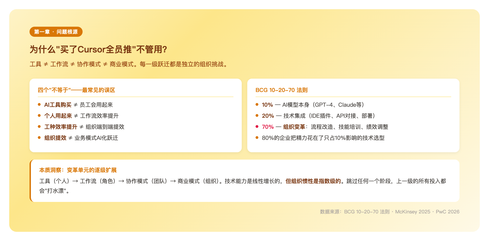
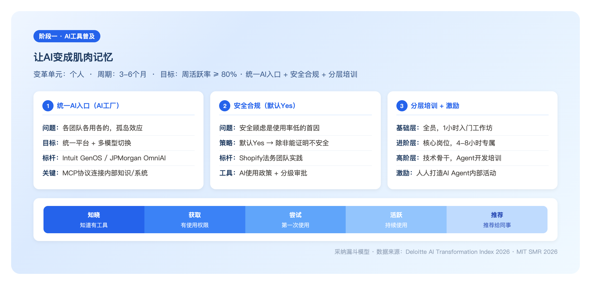
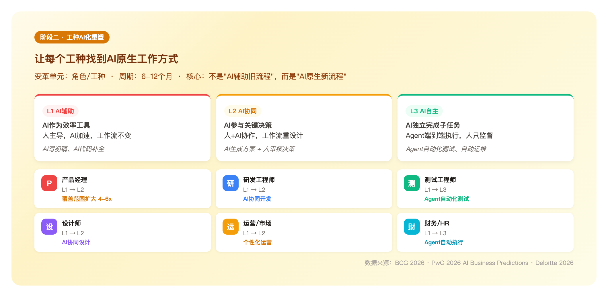
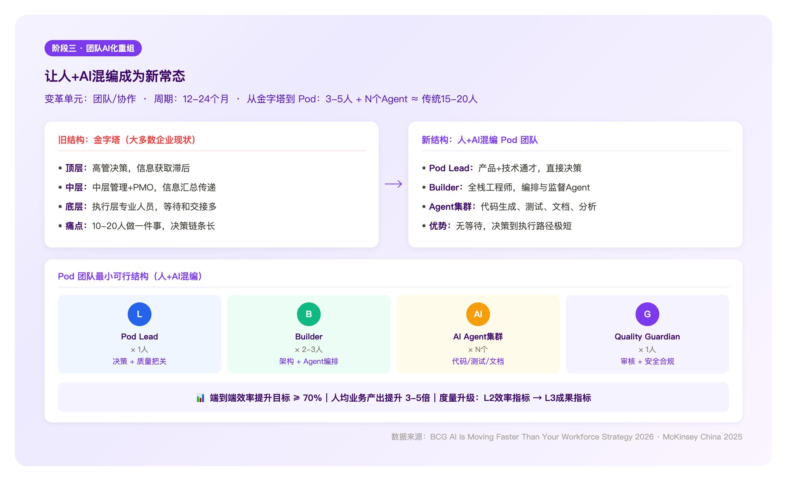
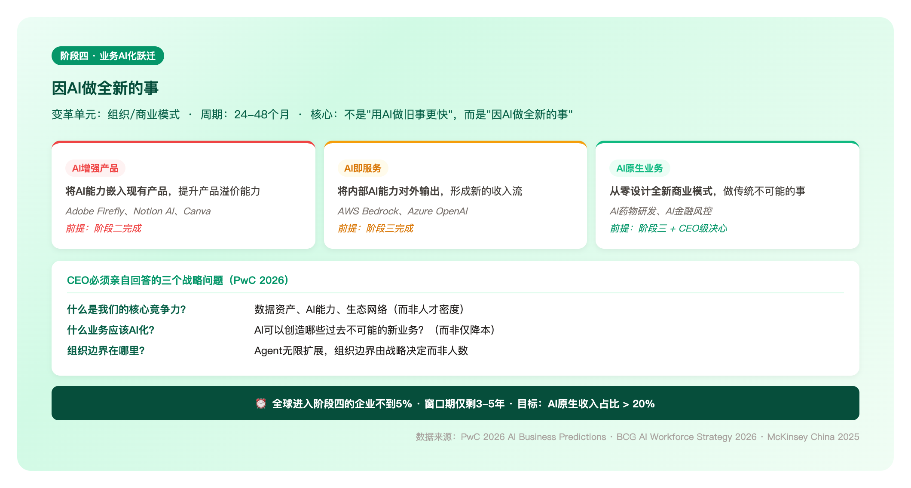

> 🌐 **优先推荐阅读 Web 版本**：[AI组织转型深度调研报告（在线版）](https://xiaoxiong20260206.github.io/rd-efficiency-insight/01-deep-research/ai-transformation-report/index-full.html)
>
> Web 版支持**标签页导航**，可快速跳转各阶段；图表交互更佳，排版更清晰。本文档为同步镜像版本，供内网检索使用。

# AI组织转型深度调研

**四阶段演进模型——从AI工具普及到业务AI化跃迁的本质规律、实操路径、度量体系与趋势推演**

---

# 00 全文概览

📌 **核心结论：AI组织转型的本质是"变革单元"的逐级扩展——从个人→角色→团队→组织，技术只贡献20%的价值，80%来自工作方式的重新设计。**

80%的企业声称使用了GenAI，但其中80%没有产生显著价值提升——因为他们把"买工具"等同于"转型"。真正的转型是四个阶段的系统性跃迁，每一级都需要不同类型的组织干预。

| 维度 | 关键发现 | 数据支撑 |
|------|---------|---------|
| **规模** | 80%企业卡在阶段一，<5%真正进入阶段四 | McKinsey 2025 |
| **本质** | 技术只占10-20%，70-80%是组织变革 | BCG 10-20-70法则 |
| **趋势** | 2026是阶段一→阶段二的分水岭年 | MIT SMR 2026 |
| **窗口** | AI时代变革窗口期仅3-5年 | BCG 2026 |
| **收益** | Pod团队3-5人产出≈传统15-20人 | BCG + Deloitte |

**5大行动预判**：(1) 别再只看使用率，要看业务产出；(2) 找高层选定少数场景，聚焦做透；(3) 工作流重设计优先于工具部署；(4) 度量标准从"做了多少"切换到"值多少"；(5) 2026年是布局阶段四的最佳时间窗口。

---

# 01 问题根源：为什么"买了 Cursor / Manus / OpenClaw 等AI工具全员推"不管用

## 1.1 核心不等式：四个"不等于"

企业AI转型存在四个本质性鸿沟：

| 阶段 | 典型表现 | 关键卡点 | 跨越条件 |
|------|---------|---------|---------|
| **AI工具普及** | 采购 Cursor / Manus / OpenClaw 等AI工具，发邮件通知 | 用不用全靠自觉 | 场景化引导 + 使用度量 |
| **个人提效** | 10%高手用得飞起，90%观望 | 无法复制高手经验 | 最佳实践沉淀 + 培训体系 |
| **组织提效** | 团队交付周期实际缩短 | 人效提升被需求填满 | 度量体系 + 资源再分配 |
| **业务AI化跃迁** | 组织形态、业务模式重塑 | 惯性思维、既得利益 | 战略决心 + 组织变革 |

## 1.2 BCG 10-20-70法则

> "大多数公司在AI转型上失败，不是因为技术不行，而是因为他们把90%的精力花在了只占10%影响的技术选型上，却忽略了占70%影响的组织变革。"
> —— BCG 数字化转型研究报告

- **10%** 是AI模型本身（GPT-4、Claude等）
- **20%** 是技术集成（IDE插件、API对接、私有化部署）
- **70%** 是组织变革（流程改造、技能培训、绩效调整、文化重塑）

## 1.3 三种常见"假转型"

- **工具驱动**：采购最新工具→发License→发邮件→等待奇迹。**结果：使用率不到20%，半年后续费困难**
- **KPI驱动**：设定"AI代码生成率50%"硬指标→不管质量只看数字。**结果：数字好看，代码质量下降**
- **精英驱动**：AI高手做试点→试点成功→全面推广失败。**结果：试点永远是试点，无法规模化**

## 1.4 本质洞察：变革单元的逐级扩展

📌 **AI组织转型的本质，是"变革单元"的逐级扩展。从工具（个人）→ 工作流（角色）→ 协作模式（团队）→ 商业模式（组织），技术能力是线性增长的，但组织惯性是指数级的。**

| 阶段 | 变革单元 | 解决的核心问题 | 所需组织干预 | 跳过的代价 |
|------|---------|-------------|------------|---------|
| **AI工具普及** | 个人 | "能不能用起来" | 采购 + 培训 | 不可能跳过 |
| **工种AI化重塑** | 角色/工种 | "怎么深度用" | 工作流重设计 | 用了但没效果 |
| **团队AI化重组** | 团队/协作 | "人+AI怎么配合" | 度量体系 + 结构调整 | 局部优化、整体不变 |
| **业务AI化跃迁** | 组织/模式 | "做什么、谁来做" | 战略重塑 + 文化变革 | 被后来者颠覆 |

## 1.5 智能手机类比：为什么跃迁节奏不可逆

| 智能手机时代 | AI转型对应 | 发生了什么 |
|------------|----------|---------|
| 人手一部智能机 | AI工具普及 | 大多数人只用来打电话、发微信——"新设备，旧用法" |
| 各工种深度使用 | 工种AI化重塑 | 摄影师用手机拍照修图、记者用手机现场写稿——每个工种被重新定义 |
| 一人拍+剪+发 | 团队AI化重组 | 以前做一条视频需要10人，现在1人完成——协作方式彻底重构，生产率飞跃在此 |
| 抖音/美团/移动支付 | 业务AI化跃迁 | 功能机时代不可能存在的全新业态 |

## 1.6 2026年全景：谁在哪个阶段

📌 **现状：74%的企业还没完成阶段一到阶段二的跃迁，真正进入阶段四的不到5%。**

| 占比 | 所在阶段 | 典型表现 |
|-----|---------|---------|
| **37%** | 停留在表面使用（阶段一：AI工具普及） | 买了工具，使用率不到20% |
| **30%** | 正在重设计关键流程（阶段二：工种AI化重塑） | 部分工种工作流有AI参与 |
| **34%** | 开始深度变革（阶段三探索） | 试点Pod团队 |
| **<5%** | 真正业务AI化跃迁（阶段四先锋） | AI原生收入已可见 |

> Deloitte 2026：员工AI工具使用率在2025年上升了50%，但企业在基础设施、数据质量、风险治理和人才储备方面的"准备度"反而**下降**了。

## 1.7 趋势推演：未来18个月将发生什么

| 趋势 | 2026上半年 | 2026下半年-2027 | 驱动力 |
|------|----------|---------------|------|
| GenAI从个人工具变为组织资源 | 头部企业建立"AI工厂/AI Studio" | 企业级AI平台成为标配 | MIT SMR：个人生产力增量"不可衡量" |
| Agentic AI从炒作进入落地 | 实际benchmark出现，落地案例增多 | 高价值工作流中Agent常态化 | PwC："Agent元年"可能到来 |
| "AI通才"取代专业分工 | PM覆盖范围扩大4-6倍 | 知识型劳动力呈"沙漏型" | BCG：职能边界消融 |
| 团队从金字塔变为扁平Pod | 先锋企业开始取消中间协调层 | 人+AI混合小团队成为主流 | BCG：4种组织原型浮现 |
| AI治理从可选变为必选 | 仅1/5企业有成熟Agent治理 | CAIO角色普及 | Deloitte：Agent速度超过治理能力 |

📌 **最关键预测**：2026年将是"阶段一到阶段二"的分水岭年。MIT SMR："If 2025 was the year of realizing that generative AI has a value-realization problem, 2026 will be the year of doing something about it."

## 1.8 为什么跃迁如此困难：PwC的80/20法则

每一级阶段跃迁难度呈**指数级**增长：技术只贡献20%的价值，**80%的价值来自工作方式的重新设计**。

| 跃迁 | 技术侧（20%） | 组织侧（80%） | 为什么卡住 |
|------|------------|------------|---------|
| 阶段1→2 | 工具已部署 | 需要重设计每个工种的工作流 | 个人习惯难改，缺乏最佳实践模板 |
| 阶段2→3 | 工作流已优化 | 需要重构团队协作模式和度量体系 | 组织惯性巨大，既得利益阻力 |
| 阶段3→4 | 团队已重组 | 需要重新定义"做什么"和"谁来做" | 需要CEO级别的战略决心 |

---

# 02 阶段一：AI工具普及（目标→度量→实施）

**变革单元：个人 · 周期：3-6个月 · 里程碑：周活跃使用率 ≥ 80%**

## 2.1 目标：让AI变成肌肉记忆

阶段一的目标是让AI工具进入每个人的工作流，形成基本使用习惯。三个"让"：

1. **让工具可用**——统一AI入口，建设基础设施
2. **让员工敢用**——安全与合规框架，解除顾虑
3. **让员工想用**——培训与激励，降低门槛

**成功标准**：问每个人"上周用AI做了什么"，人人都能说出具体场景。

## 2.2 度量：如何知道阶段一成功了

### 结果指标（北极星）

| 指标名称 | 定义 | 目标值 | 数据来源 |
|---------|-----|-------|--------|
| **周活跃使用率** | 每周至少使用1次AI工具的员工占比 | ≥ 80% | 工具后台统计 |
| **安全合规达标率** | 符合AI使用规范的行为占比 | 100% | 安全审计日志 |
| **统一入口覆盖率** | 通过统一平台使用AI的占比 | ≥ 90% | 平台统计 |

### 过程指标（执行健康度）

| 指标名称 | 监控频率 | 预警阈值 | 应对措施 |
|---------|--------|--------|--------|
| 培训完成率 | 月 | < 90% 需追踪 | 强化培训覆盖 |
| 工具满意度NPS | 季度 | NPS < 30 需优化 | 收集反馈改进体验 |
| 问题工单量 | 周 | 周增长 > 20% | 加强支持力量 |

### 评估模型：采纳漏斗（Adoption Funnel）

📌 **知晓 → 获取 → 尝试 → 活跃 → 推荐**

每个环节的转化率都要监控：
- "知晓→获取"转化低：权限流程有问题
- "尝试→活跃"转化低：工具体验或培训有问题

> "Companies with 80%+ tool penetration are 3x more likely to achieve measurable productivity gains in the next phase."
> —— Deloitte, AI Transformation Index 2026

## 2.3 实施：三件事 + 90天路线

### 统一AI入口：建设"AI工厂"而非散装工具

| 维度 | 散装模式（多数企业） | AI工厂模式（先锋企业） |
|------|--------------|--------------|
| 工具选择 | 各团队自选，五花八门 | 统一平台，多模型切换 |
| 数据连接 | AI无法访问内部系统 | MCP协议连接内部知识/系统 |
| 能力复用 | 每个人从零开始 | 预构建模板、Agent、工作流 |
| 标杆实践 | — | Intuit GenOS / JPMorgan OmniAI |

### 安全与合规：用"默认Yes"替代"默认No"

**Shopify法务"默认Yes"策略**：从"先证明安全再用"转变为"除非能证明不安全才禁止"。具体：制定清晰AI使用政策 + 建立分级审批 + 定期更新边界。

### 培训与激励：分层培训

| 培训层级 | 对象 | 目标 | 形式 |
|---------|-----|-----|-----|
| **基础层** | 全员 | 会用AI完成日常任务 | 1小时入门工作坊 + Prompt模板 |
| **进阶层** | 核心岗位 | 将AI融入专业工作流 | 工种专属AI工作坊（4-8小时） |
| **高阶层** | 技术骨干 | 构建AI Agent/自动化流程 | Agent开发培训 + 内部黑客松 |

### 90天落地路线

| 阶段 | 时间 | 关键动作 | 交付物 |
|------|-----|---------|------|
| **准备期** | M0-M1 | 工具选型、安全评估、License采购 | AI使用政策 + 统一平台上线 |
| **试点期** | M1-M2 | 选3-5个标杆团队先行试用 | 使用手册 + 最佳实践初稿 |
| **推广期** | M2-M3 | 全员培训、激励机制上线、使用度量 | 周活跃率 > 80% |

📌 **PwC核心建议："Go Narrow and Deep"——让高层选定少数高价值工作流，聚焦做透，而非撒胡椒面。**

---

# 03 阶段二：工种AI化重塑（目标→度量→实施）

**变革单元：角色/工种 · 周期：6-12个月 · 里程碑：关键工种交付效率翻倍**

## 3.1 目标：让每个工种找到AI原生工作方式

阶段一解决"能不能用起来"，阶段二要解决——每个工种如何与AI深度协同，让工作方式发生**质变**而非量变。

📌 **PwC 2026的核心论断：不是"在旧工作流中嵌入AI"，而是"从零设计AI原生新工作流"——有时意味着整个流程变成一步。**

**三个核心目标**：
1. **工种工作流重设计**——不是"AI辅助旧流程"，而是"AI原生新流程"
2. **关键工种效率翻倍**——交付周期缩短50%+，而非仅提速20-30%
3. **Agentic工作流落地**——让Agent接管重复性专业任务

## 3.2 度量：如何知道阶段二成功了

### 结果指标（北极星）

| 指标名称 | 定义 | 目标值 | 计算方式 |
|---------|-----|-------|--------|
| **关键工种效率提升** | 单工种完成相同任务的时间缩短比例 | ≥ 50% | 任务时间基线对比 |
| **AI工作流SOP覆盖率** | 已建立AI原生工作流的工种数/总工种数 | ≥ 80% | SOP文档统计 |
| **关键工种Agent覆盖率** | 核心流程有Agent参与的工种占比 | ≥ 60% | 流程审计 |

### 分工种过程指标

| 工种 | 核心过程指标 | 目标值 | 注意事项 |
|-----|-----------|------|--------|
| 研发 | AI代码采纳率、编码周期缩短 | 采纳率 ≥ 25%，周期 -30% | 采纳率高但周期不变说明有问题 |
| 测试 | AI用例生成率、自动化覆盖率 | 生成率 ≥ 50%，覆盖 ≥ 70% | 关注用例质量，不只是数量 |
| 产品 | AI辅助PRD比例、需求澄清轮次减少 | 辅助 ≥ 60%，轮次 -40% | PRD质量需额外评估 |
| 设计 | AI设计稿采用率、设计周期缩短 | 采用 ≥ 40%，周期 -35% | 创意质量需人工评估 |

### 评估模型：L1/L2/L3成熟度 + 工种效能矩阵

| 成熟度 | 定义 | 特征 | 典型场景 |
|-------|-----|-----|--------|
| **L1 AI辅助** | AI作为效率工具 | 人主导，AI加速；工作流不变 | AI写初稿、AI翻译、AI代码补全 |
| **L2 AI协同** | AI参与关键决策 | 人+AI协作，工作流重设计 | AI生成方案 + 人审核决策 |
| **L3 AI自主** | AI独立完成子任务 | Agent端到端执行，人只做监督 | Agent自动化测试、自动运维 |

**工种效能矩阵（2×2诊断）**：横轴=AI工具使用深度，纵轴=效率提升幅度
- 右上象限（深度+高效）：标杆工种，可复制推广
- 左上象限（浅用+高效）：天花板近，需深化
- 右下象限（深度+低效）：方向错误，需重新审视
- 左下象限（浅用+低效）：需要更多赋能和培训

## 3.3 实施：分工种AI化重塑路线图（6-12个月）

### 工作流重设计核心方法

不是问"AI放在哪里"，而是问**"如果从零设计，怎么做"**。以PM为例：

| 环节 | 传统流程 | AI辅助（阶段一） | AI原生（阶段二目标） |
|-----|---------|-------------|-------------|
| 需求发现 | 用户访谈 + 竞品调研 | AI辅助写调研问卷 | Agent自动抓取反馈、生成需求洞察 |
| 需求定义 | PM独立撰写PRD | AI帮写PRD初稿 | Agent基于洞察直接生成PRD + 原型 + 测试用例 |
| 进度管理 | 每日站会 + 手动更新 | AI总结会议纪要 | Agent实时同步进度，异常自动预警 |

BCG 2026：在AI原生模式下，**一个PM的覆盖范围可以扩大4-6倍**。

### 六大工种AI化重塑路径

| 工种 | 当前普遍水平 | 阶段二目标 | 关键变化 |
|-----|-----------|---------|--------|
| 研发工程师 | L1 代码补全 | L2 AI协同开发 | 从"AI补全代码"到"AI生成模块 + 人审核 + AI测试" |
| 测试工程师 | L1 AI辅助写用例 | L3 Agent自动化测试 | 从"AI帮写测试脚本"到"Agent自动生成 + 执行 + 回归" |
| 产品经理 | L1 AI辅助写文档 | L2 AI协同产品设计 | 从"AI写PRD"到"AI洞察需求 + 生成方案 + 模拟验证" |
| 设计师 | L1 AI生图 | L2 AI协同设计 | 从"AI出草图"到"AI生成多方案 + 人选定 + AI出终稿" |
| 运营/市场 | L1 AI写文案 | L2 AI个性化运营 | 从"AI写通稿"到"Agent分人群生成个性化内容" |
| 财务/HR | L1 AI辅助分析 | L3 Agent自动执行 | Agent处理发票、匹配订单、对账、异常检测 |

### 落地六步法

| 步骤 | 动作 | 交付物 | 周期 |
|-----|-----|------|-----|
| Step 1 | 选择3-5个高ROI工种作为试点 | 优先级矩阵（ROI × 复杂度） | W1-W2 |
| Step 2 | 对每个工种做"一日工作流审计" | 当前工作流地图 | W2-W3 |
| Step 3 | 设计AI原生工作流 | 目标工作流地图 + 人机分工矩阵 | W3-W5 |
| Step 4 | 构建必要的Agent/自动化流程 | 可用的Agentic工作流 | W5-W10 |
| Step 5 | 试点团队试跑2-4周，收集数据 | 效率对比数据 + 问题清单 | W10-W14 |
| Step 6 | 迭代优化后推广到全工种 | 标准化AI工作流手册 | W14-W24 |

📌 **Deloitte关键提醒：度量标准必须升级。用"代码行数"衡量AI辅助开发是荒谬的——新度量应聚焦业务产出，而非工作量。**

---

# 04 阶段三：团队AI化重组（目标→度量→实施）

**变革单元：团队/协作 · 周期：12-24个月 · 里程碑：端到端效率3-5倍提升**

## 4.1 目标：让人+AI混编成为新常态

这是生产率飞跃发生的阶段。以前做一条视频需要摄像+剪辑+运营十个人，现在一个人拿着手机就能拍、剪、发——团队从10人变3人，协作方式彻底重构。

📌 **什么是Pod团队？按业务目标组建的跨职能小队（3-5人），AI Agent作为"虚拟成员"加入，承担代码生成、测试、文档、数据分析等工作，使极小的人类团队就能覆盖过去大团队的产出。**

**三个核心目标**：
1. **团队结构扁平化**——从金字塔到Pod，消除因信息传递而存在的中间层
2. **人机混编常态化**——Agent不是工具，而是"团队成员"
3. **端到端效率3-5倍提升**——不是单工种快，而是整体流程快

## 4.2 度量：如何知道阶段三成功了

### 结果指标（北极星）

| 指标名称 | 定义 | 目标值 | 计算方式 |
|---------|-----|-------|--------|
| **端到端效率提升** | 从需求提出到上线的完整周期缩短比例 | ≥ 70% | 周期基线对比 |
| **人均业务产出** | 团队业务交付量/人数（含Agent贡献折算） | 提升3-5倍 | 业务产出统计 |
| **Pod团队覆盖率** | 采用Pod模式的核心业务占比 | ≥ 50% | 组织形态统计 |

### 过程指标（组织健康度）

| 指标名称 | 监控频率 | 健康阈值 | 异常信号 |
|---------|--------|--------|--------|
| 跨职能协作等待时间 | 周 | < 1天 | > 3天说明壁垒仍在 |
| 决策到执行响应时长 | 周 | < 2小时 | 链条过长，需简化 |
| 管理跨度（每个管理者带人数） | 月 | 增加2-3倍 | 不增加说明扁平化不够 |
| Agent输出采纳率 | 周 | ≥ 70% | 过低说明Agent质量不足 |

### 评估模型：BCG四种组织原型 + 度量三级跃迁

**BCG 2026四种组织原型**：

| 原型 | 核心策略 | 人才结构 | 适用场景 |
|-----|---------|--------|--------|
| **Scaler** | 用AI放大现有业务规模 | 保持团队规模，AI提升人均产出 | 业务增长快但招人难 |
| **Streamliner** | 用AI精简流程和团队 | 减少执行层，增加AI编排层 | 成熟业务需要降本增效 |
| **Horizon Builder** | 用AI探索全新业务方向 | 小团队+大量Agent，快速试错 | 需要创新突破 |
| **Reinventor** | 全面重新定义组织运营模式 | 人+AI混合团队，打破职能边界 | 面临行业颠覆 |

📌 **度量体系三级跃迁：L1 活动指标（"做了多少"）→ L2 效率指标（"快了多少"）→ L3 成果指标（"值多少"）。阶段三必须完成从L2到L3的跃迁。**

## 4.3 实施：团队AI化重组三步走（12-24个月）

### 为什么中间层在消失

| 传统角色 | 存在的原因 | AI时代的变化 |
|---------|---------|-----------|
| 中层管理者 | 信息汇总与传递 | AI实时汇总，管理者从"传话"变为"决策" |
| 协调角色（PMO等） | 跨团队信息同步 | Agent自动同步，人工协调需求锐减 |
| 执行层专业人员 | 专业技能执行 | 从"专家"变为"通才 + Agent编排者" |

### Pod团队最小可行结构

| 角色 | 数量 | 职责 |
|-----|-----|-----|
| **Pod Lead**（产品+技术通才） | 1人 | 业务目标定义、优先级决策、质量把关 |
| **Builder**（全栈工程师） | 2-3人 | 架构设计、关键代码、Agent编排与监督 |
| **AI Agent集群** | N个 | 代码生成、测试、文档、数据分析、运维 |
| **Quality Guardian** | 1人 | Agent输出审核、安全合规、用户体验把关 |

这个3-5人的Pod团队，配合AI Agent集群，理论产出相当于传统15-20人团队。

### 重建度量体系：从"忙不忙"到"值不值"

| 传统度量 | 问题 | AI时代替代指标 |
|---------|-----|-------------|
| 代码行数 / PR数 | Agent写大量代码，但质量参差 | Feature完成度 × 用户满意度 |
| 工时 / 人天 | AI压缩工时但增加迭代次数 | 从需求到上线的端到端时长 |
| Bug数量 | Agent生成代码的Bug特征不同 | 线上故障率 × 平均修复时长 |
| 团队人数 | 不再能反映实际产能 | 人均业务产出（含Agent产出） |

📌 **麦肯锡警告：AI确实让团队更快了，但省出来的时间被新增需求填满，结果交付周期没变。度量体系必须从"做了多少"切换到"值多少"，才能锁定AI效率红利。**

> "What today feels cutting-edge in AI workforce strategy will be table stakes by 2030."
> —— BCG, AI Is Moving Faster Than Your Workforce Strategy, 2026

---

# 05 阶段四：业务AI化跃迁（目标→度量→实施）

**变革单元：组织/商业模式 · 周期：24-48个月 · 里程碑：AI原生收入占比 > 20%**

## 5.1 目标：因AI做全新的事

智能手机革命的最终阶段不是"手机用得更高效"——而是**智能手机催生了全新的产业**：短视频、外卖平台、移动支付。同理，AI的终极价值不是"用AI做原来的事做得更快"，而是**"因为有了AI，做了全新的事"**。

**三个核心目标**：
1. **战略重塑**——重新回答"做什么"的问题
2. **AI原生收入 > 20%**——把AI能力变成新的收入来源
3. **生态构建**——从单体组织到AI增强的生态系统

**成功标准**："你的业务有一部分是因为AI才可能存在的"——这说明AI不只是工具，而是业务本身的一部分。

## 5.2 度量：如何知道阶段四成功了

### 结果指标（北极星）

| 指标名称 | 定义 | 目标值 | 计算方式 |
|---------|-----|-------|--------|
| **AI原生收入占比** | 因AI才可能存在的业务收入 / 总收入 | > 20% | 业务分类统计 |
| **新市场份额** | AI创造的新业务在新兴市场的份额 | 领先地位 | 市场调研 |
| **生态合作伙伴数** | 接入/使用企业AI能力的外部伙伴数量 | 规模化增长 | 合作统计 |

### 过程指标（战略健康度）

| 指标名称 | 监控频率 | 健康阈值 | 意义 |
|---------|--------|--------|-----|
| AI Only功能占比 | 季度 | 产品路线图 ≥ 30% | 创新方向是否足够激进 |
| 创新项目ROI回收周期 | 半年 | ≤ 18个月 | 创新是否有商业价值 |
| AI治理成熟度评分 | 季度 | ≥ 4分（5分制） | 治理能否支撑业务扩展 |
| 负责任AI指标（RAI） | 季度 | 客户信任度 ≥ 80% | PwC：60%认为RAI提升ROI |

### 评估模型：商业模式创新 + 治理成熟度

**三种AI驱动商业模式**：

| 模式 | 描述 | 典型案例 | 前提条件 |
|-----|-----|--------|--------|
| **AI增强产品** | 将AI能力嵌入现有产品，提升溢价 | Adobe Firefly, Notion AI | 阶段二完成 |
| **AI即服务** | 将内部AI能力对外输出 | AWS Bedrock, Azure OpenAI | 阶段三完成 |
| **AI原生业务** | 从零设计，做传统不可能的事 | AI药物研发、AI金融风控 | 阶段三 + CEO级决心 |

📌 **PwC治理三层防护：L1 自动化防护（实时监控）→ L2 人工审核（高风险介入）→ L3 独立评估（第三方审计）。治理成熟度直接影响AI业务的可扩展性。**

## 5.3 实施：业务AI化跃迁路线图（24-48个月）

### CEO必须亲自回答的三个问题

📌 **PwC 2026：AI转型必须是自上而下的战略行为，而非自下而上的众包运动。**

| 问题 | 传统思维 | AI时代思维 |
|-----|---------|---------|
| "什么是我们的核心竞争力？" | 人才密度、专业知识、规模效应 | 数据资产、AI能力、生态网络 |
| "什么业务应该AI化？" | 人力密集的业务可以用AI降本 | AI可以创造哪些过去不可能的新业务？ |
| "组织边界在哪里？" | 员工数决定产能上限 | Agent无限扩展，组织边界重新定义 |

### 四阶段推进框架

| 阶段 | 时间 | 关键动作 | 交付物 |
|-----|-----|---------|------|
| **战略研判** | M1-M3 | CEO牵头，评估AI对行业格局的颠覆性影响 | AI战略白皮书 + 机会清单 |
| **创新孵化** | M3-M9 | 选1-2个"AI原生业务"方向，快速试错 | MVP + 市场验证数据 |
| **规模化验证** | M9-M18 | 成功方向投入规模化资源，建立AI治理框架 | 可规模化新业务 + 完整治理体系 |
| **生态构建** | M18-M36 | 将AI能力生态化，构建合作伙伴网络 | AI生态系统 + 持续增长新收入 |

📌 **PwC的"AI Studio"模式**：一个集中式创新枢纽，汇集可复用的技术组件、用例评估框架、测试沙盒、部署协议和专业人才。它把业务目标和AI能力连接起来，**让你快速发现高ROI的创新机会**。

### 2028年展望：窗口期3-5年

目前全球真正进入阶段四的企业**不到5%**。但BCG预测："今天感觉先进的做法，到2030年将成为基本要求。"智能手机从打电话到催生抖音、美团，大约用了7-8年。AI时代的节奏可能更快——**窗口期可能只有3-5年**。现在已经是2026年了。

---

# 06 总结：行动指南

## 6.1 诊断：你在哪个阶段？

| 信号 | 你在哪里 |
|-----|--------|
| "AI工具使用率很高，但不知道产生了什么价值" | 阶段一 |
| "某些工种效率提升了，但团队整体交付没变" | 阶段一→二的跃迁中 |
| "关键工种建立了AI原生工作流，效率翻倍" | 阶段二 |
| "Pod团队已经在运转，人均产出大幅提升" | 阶段三 |
| "有业务收入来自AI才可能实现的新模式" | 阶段四 |

## 6.2 下一步行动

**如果你在阶段一**：
- 先检查采纳漏斗，找到最大的漏点
- 选定3-5个高ROI场景，聚焦做透（PwC: Go Narrow and Deep）
- 把"使用率"度量升级为"业务产出"度量

**如果你在阶段一→二的跃迁中**：
- 选1-2个优先工种，做完整工作流审计
- 问"如果从零设计，怎么做"——不是AI放哪里
- 建立工种效能矩阵，识别标杆，可复制推广

**如果你在阶段二→三的跃迁中**：
- 选一个试点业务，组建第一个Pod团队
- 同时重建度量体系：从"做了多少"→"值多少"
- 警惕"AI提效红利被新需求填满"陷阱

**如果你在阶段三→四的跃迁中**：
- CEO必须亲自回答三个战略问题
- 建立AI治理框架（三层防护）
- 选1个"AI原生业务"方向，快速MVP验证

## 6.3 关键风险提醒

- 跳过阶段一直接做流程重设计——基础不牢
- 把"AI使用率高"等同于"工种AI化重塑完成"——阶段一假象
- AI提效红利被新需求填满——度量体系没升级
- 忽视AI治理和安全——一次重大AI事故可能毁掉所有进展
- 把"用AI降本"包装成"业务AI化跃迁"——自欺欺人

---

# 07 彩蛋：这篇报告是怎么做出来的

这篇报告的生产过程本身，就是一次"AI工作流重设计"的实践：

1. **信息采集**：AI Agent自动抓取McKinsey、BCG、PwC、Deloitte、MIT SMR 2025-2026年最新报告的核心数据
2. **结构化提炼**：基于"变革单元逐级扩展"的核心洞察，构建四阶段分析框架
3. **度量体系内嵌**：每个阶段从"目标→度量→实施"三段式展开，让内容可落地、可验证
4. **迭代优化**：经过多轮人机协作迭代，从初稿到最终版本，主要时间花在"应该讲什么"而非"怎么写"

传统研究报告：1人×2周 = 1篇报告。这次实验：1人+AI×2天 = 更系统的报告。

报告从工具采集到最终发布，全程通过AI助手协作完成——包括这篇KIM Doc本身也是AI自动生成并上传的。这不就是阶段二工作流重设计的最好案例吗？

---

**数据来源**：[McKinsey 2025 Technology Report](https://mckinsey.com) · [BCG AI Workforce Strategy 2026](https://bcg.com) · [PwC 2026 AI Business Predictions](https://pwc.com) · [Deloitte AI Transformation Index 2026](https://deloitte.com) · [MIT SMR 2026](https://mitsmr.com)

**在线版本**：[AI组织转型深度调研报告（网页版）](https://xiaoxiong20260206.github.io/rd-efficiency-insight/01-deep-research/ai-transformation-report/index-full.html)
